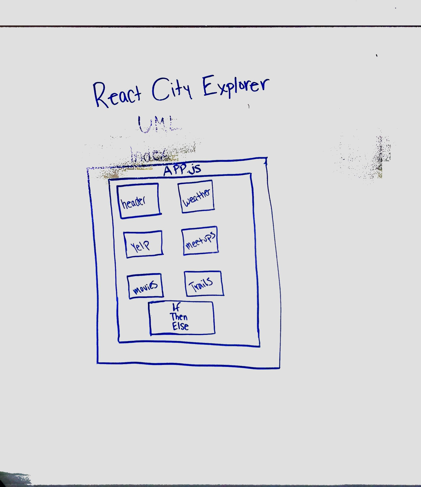

 LAB
=================================================

## React City Explorer

### Author: Hannnah Ingham and Siobhan Niess

### Links and Resources
* [repo](https://github.com/hingham/city-explorer-react)
* [aws-link](http://city-cxplorer-hi-sn.s3-website-us-west-2.amazonaws.com/)

#### Documentation
* [jsdoc](http://xyz.com)

### Modules
#### `conditional.js`
* This file contains the conditionals if an error has occured. 
#### `container.js`
* This file holds the container for the children for functions. 
#### `form.js`
* This file holds the form for the back end to enter in the url to continue into the app. 
#### `header.js`
* This file holds the header for the app. 
#### `search-form.js`
* This file holds the function that controls the search for the location and the button to explore that location. 
#### `app.js`
* This file holds the superagent calls for the loactions that you search for, the container for submission, error handling, displaying the map for your selected location, and the states for each of the templates. 
#### `index.js`
* This file holds information about supporting your app while offline.
#### `meetups.js`
* This file holds the function templates for the Meeteups in the location that you have selected. 
#### `movies.js`
* This file holds the function templates for the Movies in the location that you have selected. 
#### `trails.js`
* This file holds the function templates for the Trails in the location that you have selected. 
#### `weather.js`
* This file holds the function templates for the weather in the location that you have selected. 
#### `yelp.js`
* This file holds the function templates for the restaurants in the location that you have selected. 
#### `serviceWorker.js`
* This file allows the app to loead faster, online or offline. 

##### Setting up the app
* all dependencies present in package-json
*  `npm init creat-app my-app-name`
* `npm i` 

#### Running the app
* `npm start`
  
#### Tests
* How do you run tests?
  * npm test
* What assertions were made?
* What assertions need to be / should be made?

#### UML

# city-explorer-react
city-explorer
